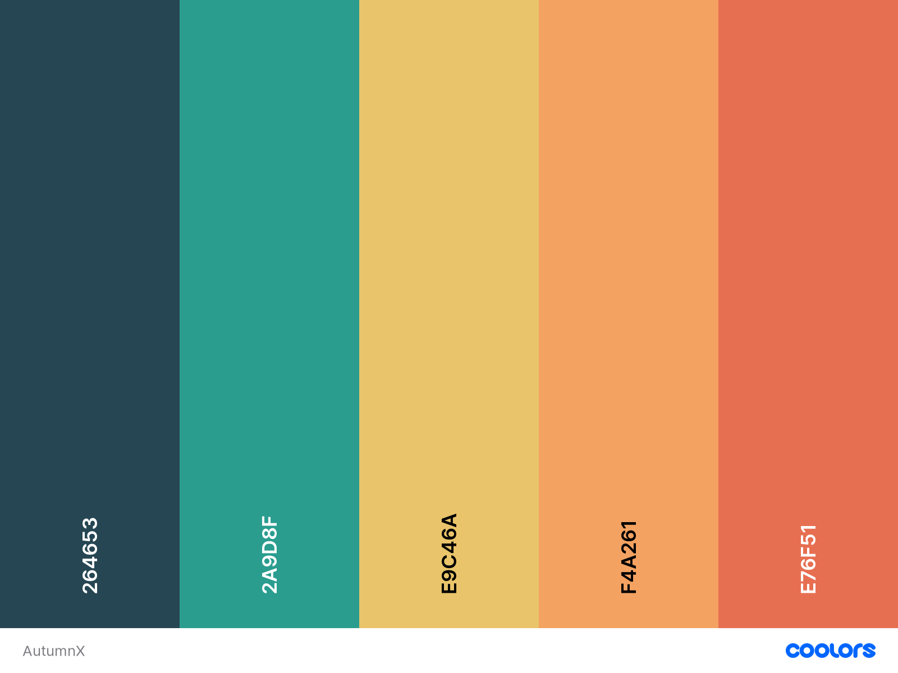

### Inlämningsuppgifter för kursen HTML5 och CSS inom YH-utbildningen Javautvecklare på EC Utbildning, Växjö.

# Projekt beskrivning

Syftet med denna uppgift är att ni skall skapa en webbsida åt en kund som kan vara ett företag eller annan verksamhet.
Exempelvis ett cafe, en butik, förening eller webbyrå. Kund kan finnas på riktigt eller vara påhittad. Ni har varit på
ett initialt möte med kunden och kommit fram till följande kravspecifikation. Webbplatsen skall uppfylla följande krav:

- #### Navigation:

  - [ ] Navigationsmeny skall synas på alla sidor.
  - [ ] Navigationmeny skall skall förändras på mobila enheter (exempelvis en hamburgermeny).
  - [ ] På Desktop skall det visas tydligt visuellt att man kan klicka på länkarna.

- #### Footer:

  - [ ] Skall synas på samtliga sidor.
  - [ ] Innehålla - Address, telefon.
  - [ ] Innehålla - Sociala medier (bilder som länkar vidare).

- #### Webbsidor skall innehålla:

  - [ ] Startsida:

    - Presentation av verksamhet (texter och bilder ev. video).
    - Ett nyhetsflöde med ett antal nyheter (presenteras med flexbox).

  - [ ] Kontaktsida:

    - Kontaktfomulär (ifyllt formulär skickas till valfri email)

      - Namn. :+1:
      - Email. :+1:
      - ~~Ämne~~.

    - Skall ha någon form av validering.

  - [ ] Galleri-sida:

    - Galleri med bilder med tillhörande text (exempelvis produkter eller anställda).
    - Presenteras med CSS-grid eller flexblox.

  - [ ] Valfri sida:
    - Valfritt innehåll.

---

## Project content:

### AutumnX is a virtual Imaginative photographing agency that sells its services online.

I tried to use a color pallette that is inspired by autumn session, pallette:

## 

---

### Pages:

The website contains the following html static pages:

| Pages           | Content                                                                                             |
| --------------- | --------------------------------------------------------------------------------------------------- |
| index.html      | A landing page with a heading and paragraph to tell about the agency.                               |
| Mission.html    | Shows What is the vision of the agnecy, `
 with an ` with slide effect done using jQuery.   |
| Collection.html | Demonstation of categories of photography services the agency provides.                             |
| Gallery.html    | Gallery to show some pictures, the pictures uploaded are taken by me in Kna town centrum in autmun. |
| Pricing.html    | Page that shows payments plans and prices.                                                          |
| Contact.html    | Contact form, meant to be a form to submit interest in newsletters.                                 |
